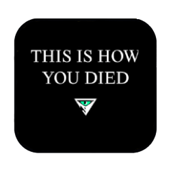

# The endgame you've been waiting for! 🕰️⚰️



TIHYD (pronounced **TIDE**) is a mod that focuses on adding fully configurable character aging functionality. As a mod that will rarely be experienced, it is guaranteed to test commitment to favorite characters.
  
_The repository folder structure is in accordance with the PZ Steam Workshop guidelines._

## Installation 🛠️ 

- Clone the repository:

  ```shell
  git clone https://github.com/Dy0gu/TIHYD.git
  ```

- Copy the inner `TIHYD` folder to the PZ mod folder.
  
## Usage ▶️ 

- Launch the game and activate the mod in the respective panel.

## Acknowledgments ©️

Thank you to all the contributors behind the [Umbrella](https://github.com/asledgehammer/Umbrella) collection, which provides EmmyLua typings for the Project Zomboid API, massively speeding up development time!
